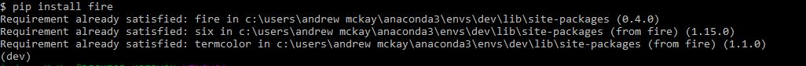
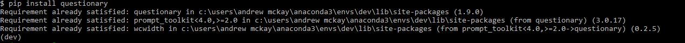
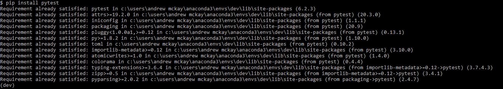
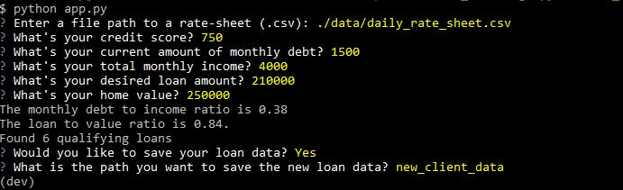
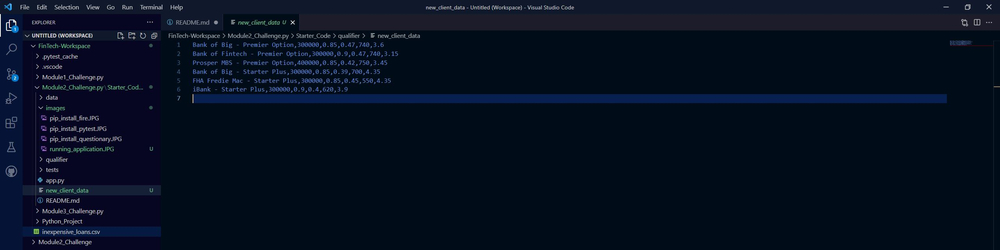
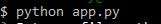
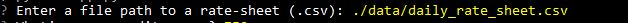
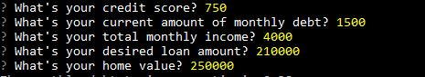

# Module 2 Challenge - Loan Qualifier Application

This is a python command-line application that allows a user to see what loans they qualify for. The application works by taking in the user's criteria for the following: credit score, income, debt, and loan information. The application then compares this criteria against 'daily_rate_sheet' to see what loans the user qualifies for based on the their input. The application then allows the user the option to save their qualified loan data to a csv file so they can acces it at a later date if neccessary. 

---

## Technologies

This was run on a pc using Windows 10

This project leverages python 3.8.8 with the follwing packages:

* [fire](https://github.com/google/python-fire) - For the command line interface, help page, and entrypoint.

* [questionary](https://github.com/tmbo/questionary) - For interactive user prompts and dialogs

* [pytest](https://docs.pytest.org/en/stable/) - For basic assertion testing of financial calculators and filters, and filio.

* [pathlib](https://docs.python.org/3/library/pathlib.html) - For location through the directory and file path.

* [csv](https://docs.python.org/3/library/csv.html) - For reading and writing csv files after running the application.

---

## Installation Guide

In this section, you should include detailed installation notes containing code blocks and screenshots.

```python
  pip install fire
  pip install questionary
  pip install pytest
```
In gitbash after you have activated your dev environment, install the following:

*Python Fire

    `pip install fire`




    `pip install questionary`




    `pip install pytest`




---

## Examples

This section should include screenshots, code blocks, or animations showing how your project works.

The two images below show what the output of the application is.






---

## Usage

This section should include screenshots, code blocks, or animations explaining how to use your project.

From the command line you enter python app.py to start running the application. 



Once the application is launched the user is asked to enter the file path for the available loans. This is where they enter the path for 'daily_rate_sheet"



Once all the data for the all the available loans are stored. The user is prompted to enter in their criteria to filter through the loans available to them.



The result is the saved file with the available qualified loans


---

## Contributors

Andrew McKay

Email: andrew.v.mckay@gmail.com

---

## License

MIT License

Copyright (c) [2021] [Andrew McKay]

Permission is hereby granted, free of charge, to any person obtaining a copy
of this software and associated documentation files (the "Software"), to deal
in the Software without restriction, including without limitation the rights
to use, copy, modify, merge, publish, distribute, sublicense, and/or sell
copies of the Software, and to permit persons to whom the Software is
furnished to do so, subject to the following conditions:

The above copyright notice and this permission notice shall be included in all
copies or substantial portions of the Software.

THE SOFTWARE IS PROVIDED "AS IS", WITHOUT WARRANTY OF ANY KIND, EXPRESS OR
IMPLIED, INCLUDING BUT NOT LIMITED TO THE WARRANTIES OF MERCHANTABILITY,
FITNESS FOR A PARTICULAR PURPOSE AND NONINFRINGEMENT. IN NO EVENT SHALL THE
AUTHORS OR COPYRIGHT HOLDERS BE LIABLE FOR ANY CLAIM, DAMAGES OR OTHER
LIABILITY, WHETHER IN AN ACTION OF CONTRACT, TORT OR OTHERWISE, ARISING FROM,
OUT OF OR IN CONNECTION WITH THE SOFTWARE OR THE USE OR OTHER DEALINGS IN THE
SOFTWARE.
